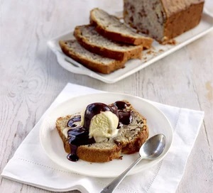

## Banana and Walnut Loaf

Definitely the best banana bread I've tried. The addition of the walnuts seems to stop it from being too stodgy

### Ingredients
* 100 soft baking spread 
* 140g sugar (a mix of white caster and soft brown) 
* 1 egg, beaten 
* 225g plain flour (a mix of wholemeal and white) 
* 2tsp baking powder 
* 4 very ripe bananas 
* 85g chopped walnuts 
* 50ml milk 

### Method
1. Heat oven to 180C / 160C fan. Grease and line a 2lb loaf tin.
2. Mix together spread, sugar and egg, then slowly mix in flour and baking powder. 
3. Peel, then mash the bananas, and mix everything together.
4. Pour mixture into the tin and bake for 1 hour, or until a skewer comes out clean. Allow to cool before removing from tin.

### Credits
The original recipe and the photo are published on the [BBC Good Food site](https://www.bbcgoodfood.com/recipes/banana-walnut-loaf) and the recipe is credited to Gregg Wallace.