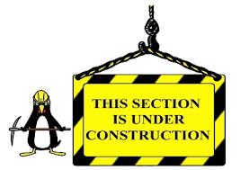

 

This site is almost permanently under construction; if you're waiting for me to finish it, 
you could be here for a long time. In the meantime, please feel free to browse through a few bits of information that 
I find useful.  

You could take a look at some of [my favourite recipes](recipes.html) 

I'm a member of the Christian community which meets at [Holy Trinity Church](https://holytrinitycoventry.org.uk) in Coventry's city centre. 
This site contains some information about our beautiful church's [history](/htc) 
as well as links to some of the music that I use when I'm playing the piano for services. 

I'm also a motorcyclst, and an active member of  [Warwickshire and Solihull Blood Bikes](https://wsbb.org). 
You can find out more about me and my bikes [on this page](/bikes/index.html)

The site is hosted on a Raspberry Pi 5. It is written mainly in Markdown and published with Jekyll. There is more information [on this page](/web-tech.html)

## That's all folks!
