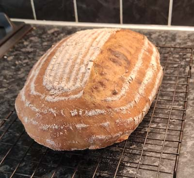

## Sourdough bread

Just a normal sourdough recipe based on the "Bake with Jack" website and YouTube channel, links below.

### Ingredients
- 100g sourdough starter 
- 450g flour 
- 8g salt 
- 300ml water at room temperature 

### Method
1. Mix the starter with some of the water to loosen it, then add the flour, salt and remaining water. Mix with a dough scraper to make a rough dough. Moisten the dough with a spray of water and leave to stand for 30 minutes. 
2. Tip dough onto a moistened work surface, and using wet hands, fold, stretch and turn dough about a dozen times until well mixed, lump free, and starting to become a little stretchy. Return dough to moistened bowl, spray with a little water, cover with a teatowel and leave to stand for about 2 hours.
3. Tip dough onto a moistened work surface, and using wet hands, fold, stretch and turn dough four or five times (or a few more if you're feeling keen). Return dough to moistened bowl, spray with a little water, cover with a teatowel and leave to stand for about 2 hours.
4. Lightly flour the worksurface and the top of the dough, and tip the dough out. Stretch, fold and turn 4 or 5 times, and return the dough to the bowl, covered, for a final hour.
5. Turn dough out onto a lightly floured worktop, and stretch, fold and roll into a sausage shape. Place into a floured banneton (seam side up) and put in fridge, uncovered, overnight.
6. Put bakestone in oven, then preheat oven to 240C. Place tray of boiling water on oven bottom. Turn dough onto a peel, slash with a grignette, and place in oven. Bake for 15 minutes, then reduce temperature to 190C and bake for a further 20 minutes.

### Credits
I started my sourdough journey by following Jack's method, which is on [his website](https://www.bakewithjack.co.uk/videos/2019/6/6/bread-tip-101-beginners-sourdough-loaf-start-to-finish).
